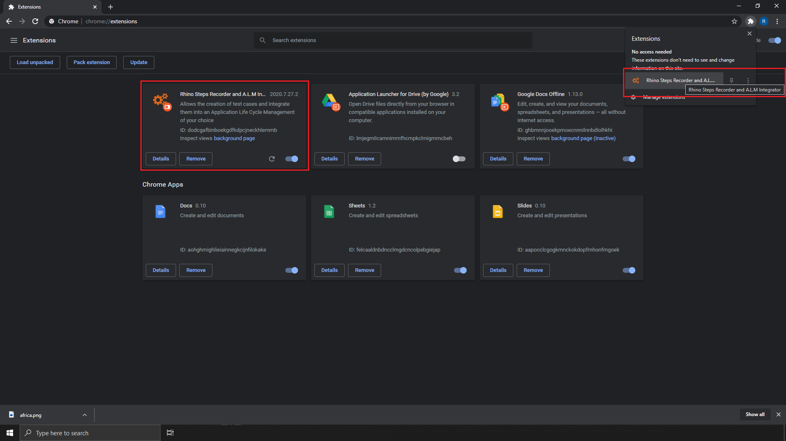

# Connect to Widget
Rhino API runs .NET Core 3.1.

## Supported Browsers
1. [Google Chrome](https://www.google.com/chrome/) - Latest
2. [MS Edge Chromium](https://www.microsoft.com/en-us/edge) - Latest

## Requierments
1. Either [Google Chrome](https://www.google.com/chrome/) or [MS Edge Chromium](https://www.microsoft.com/en-us/edge) installed.

## On Premise Installation - Google Chrome
1. Download the latest [Rhino Widget Release](https://github.com/savanna-projects/rhino-widget/releases) ZIP file.
2. Extract the file and place the extracted folder under the location you want to hold Rhino Widget (i.e. C:\Rhino\Widget).
3. Open Chrome Browser.
4. Type ```chrome://extensions/``` in the address bar, this will take you to the **Extensions** page.
5. Switch on **Developer mode**, on the top right corner of the screen


_image 1.1 - Extensions Screen, Developer Mode_  
  
6. Click on ```Load unpacked``` button.


_image 1.3 - Extensions Screen, Load Unpacked_  
  
7. Select the folder you have extracted in step NO.2 (make sure ```manifest.json``` file exists in that folder).  


_image 1.5 - Extensions Screen, Select Folder_  

8. Click on ```Select Folder``` button.


_image 1.7 - Extensions Screen, Extension Loaded_

## On Premise Installation - MS Edge
1. Download the latest [Rhino Widget Release](https://github.com/savanna-projects/rhino-widget/releases) ZIP file.
2. Extract the file and place the extracted folder under the location you want to hold Rhino Widget (i.e. C:\Rhino\Widget).
3. Open Chrome Browser.
4. Type ```edge://extensions/``` in the address bar, this will take you to the **Extensions** page.
5. Switch on **Developer mode**, on the bottom left corner of the screen


_image 1.2 - Extensions Screen, Developer Mode_  
  
6. Click on ```Load unpacked``` button.


_image 1.4 - Extensions Screen, Load Unpacked_  
  
7. Select the folder you have extracted in step NO.2 (make sure ```manifest.json``` file exists in that folder).  


_image 1.5 - Extensions Screen, Select Folder_  

8. Click on ```Select Folder``` button.


_image 1.6 - Extensions Screen, Extension Loaded_  