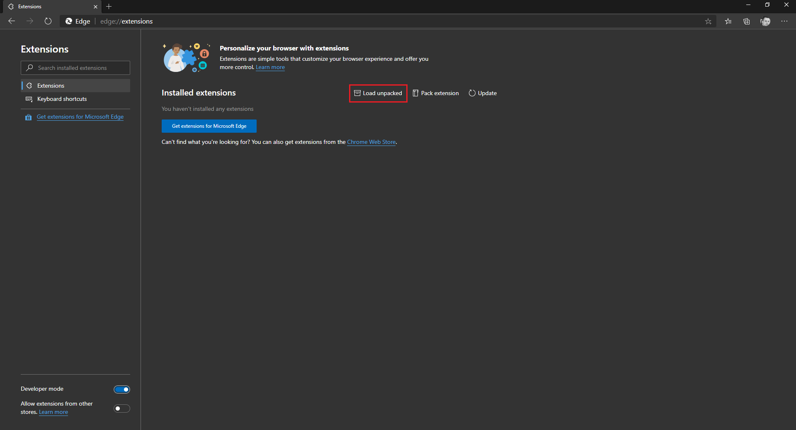
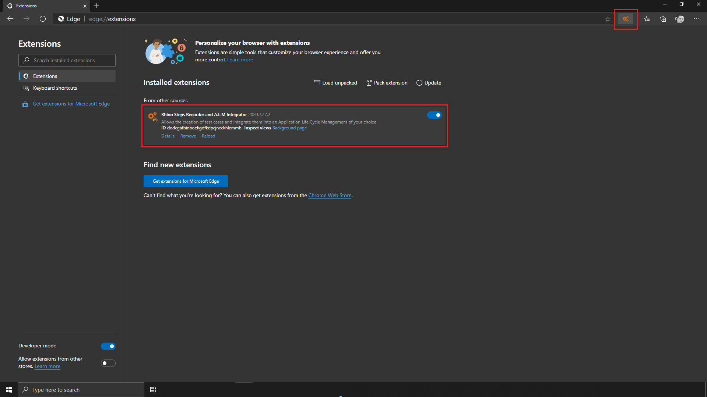
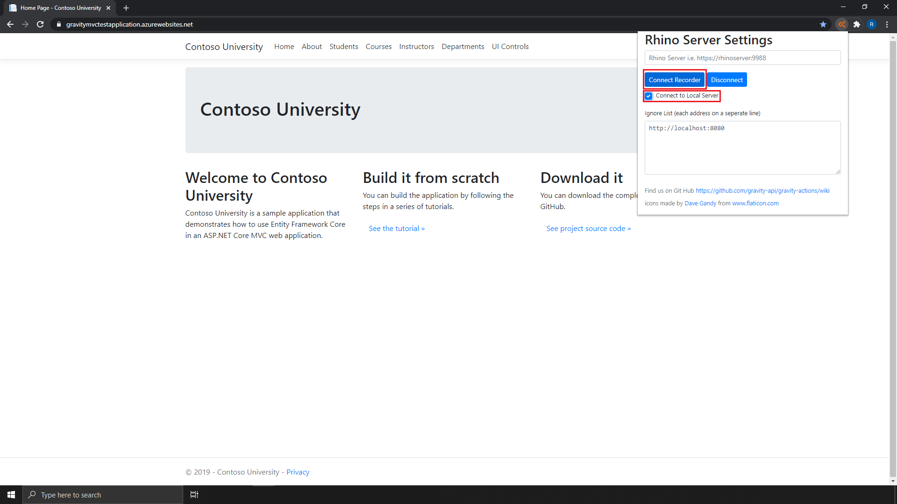
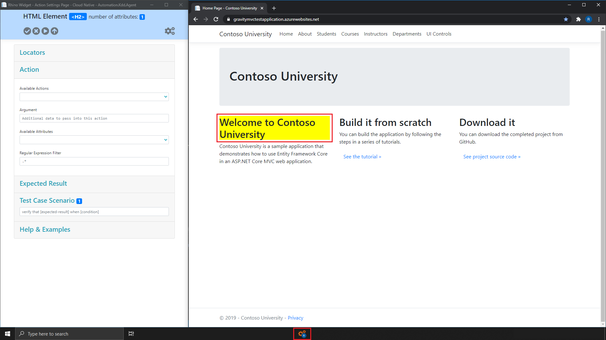
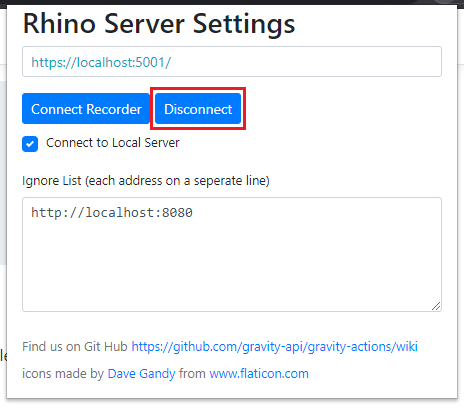

# Connect to Widget
* [Installation - Google Chrome](#on-premise-installation-google-chrome)
* [Installation - MS Edge](#on-premise-installation-ms-edge)
* [Connect](#connect)
* [Your First Automation](./YourFirstAutomation.md)

## Supported Browsers
1. [Google Chrome](https://www.google.com/chrome/) - Latest
2. [MS Edge Chromium](https://www.microsoft.com/en-us/edge) - Latest

## Requierments
1. Either [Google Chrome](https://www.google.com/chrome/) or [MS Edge Chromium](https://www.microsoft.com/en-us/edge) installed.  

> You can install Rhino Widget from the cloud, go to the relevant market place (Google Store or Edge Market Place), search for Rhino and install.  

## On Premise Installation Google Chrome
1. Download the latest [Rhino Widget Release](https://github.com/savanna-projects/rhino-widget/releases) ZIP file.
2. Extract the file and place the extracted folder under the location you want to hold Rhino Widget (i.e. C:\Rhino\Widget).
3. Open Chrome Browser.
4. Type ```chrome://extensions/``` in the address bar, this will take you to the **Extensions** page.
5. Switch on **Developer mode**, on the top right corner of the screen


_image 1.1 - Extensions Screen, Developer Mode_  
  
6. Click on ```Load unpacked``` button.


_image 1.3 - Extensions Screen, Load Unpacked_  
  
7. Select the folder you have extracted in step NO.2 (make sure ```manifest.json``` file exists in that folder).  


_image 1.5 - Extensions Screen, Select Folder_  

8. Click on ```Select Folder``` button.


_image 1.7 - Extensions Screen, Extension Loaded_

## On Premise Installation MS Edge
1. Download the latest [Rhino Widget Release](https://github.com/savanna-projects/rhino-widget/releases) ZIP file.
2. Extract the file and place the extracted folder under the location you want to hold Rhino Widget (i.e. C:\Rhino\Widget).
3. Open Chrome Browser.
4. Type ```edge://extensions/``` in the address bar, this will take you to the **Extensions** page.
5. Switch on **Developer mode**, on the bottom left corner of the screen


_image 1.2 - Extensions Screen, Developer Mode_  
  
6. Click on ```Load unpacked``` button.


_image 1.4 - Extensions Screen, Load Unpacked_  
  
7. Select the folder you have extracted in step NO.2 (make sure ```manifest.json``` file exists in that folder).  


_image 1.5 - Extensions Screen, Select Folder_  

8. Click on ```Select Folder``` button.


_image 1.6 - Extensions Screen, Extension Loaded_

## Connect
1. Navigate into the folder in which you have extracted Rhino Agent [see Deployment](./Deployment.md) for more information.
2. Run the following command:
```
dotnet Rhino.Agent.dll
```  

The following is expected:
```
Now listening on: https://localhost:5001
Now listening on: http://localhost:5000
Application started. Press Ctrl+C to shut down.
```  

3. Open Chrome or Edge.
4. Open Rhino Widget Extension.
5. Check ```Connect to Local Server``` check box.
6. Click on ```Connect Recorder``` button.


_image 1.8 - Rhino Widget Main Screen_  

The following is expected:
1. Rhino Widget is now open.
2. Moving the mouse around the web site will cause element to glow.  


_image 1.9 - Rhino Widget Connected_  

> Rhino Widget is persistent which means it will work on any browser you will open once you have connected.
> To close it, open Rhino Widget and click on ```Disconnect``` button.  
>  
>_image 1.10 - Rhino Widget Main Screen_  