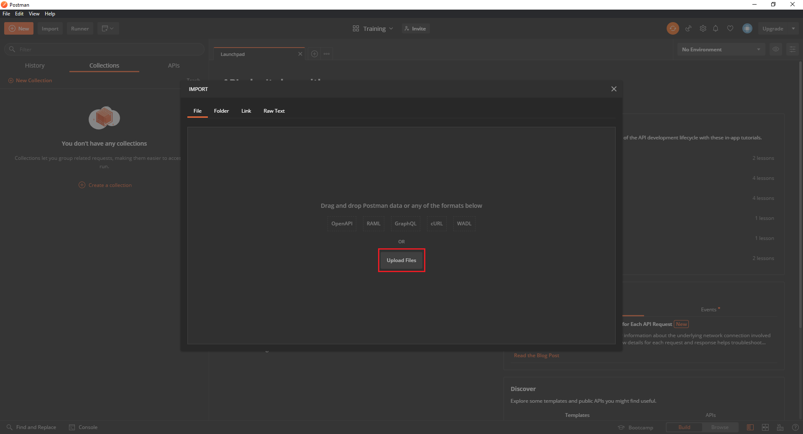
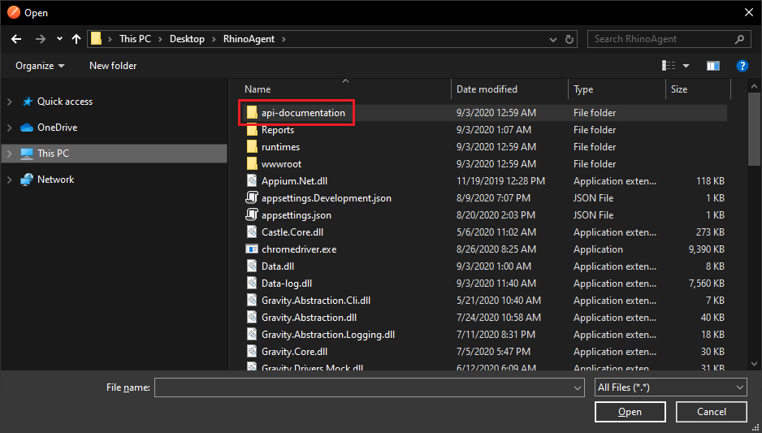
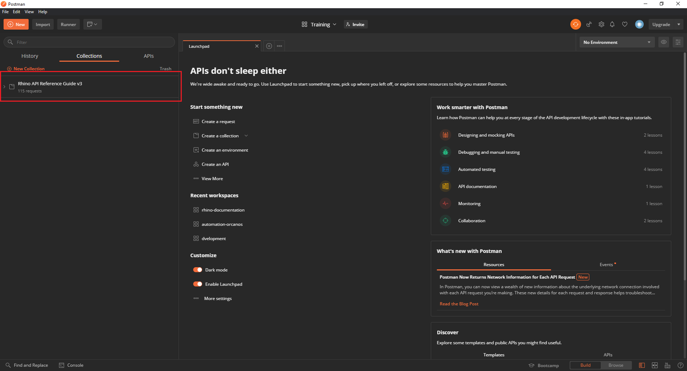
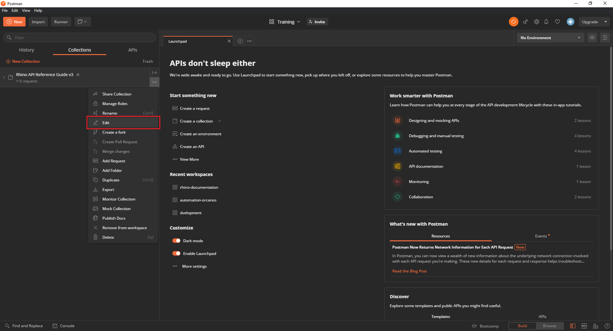
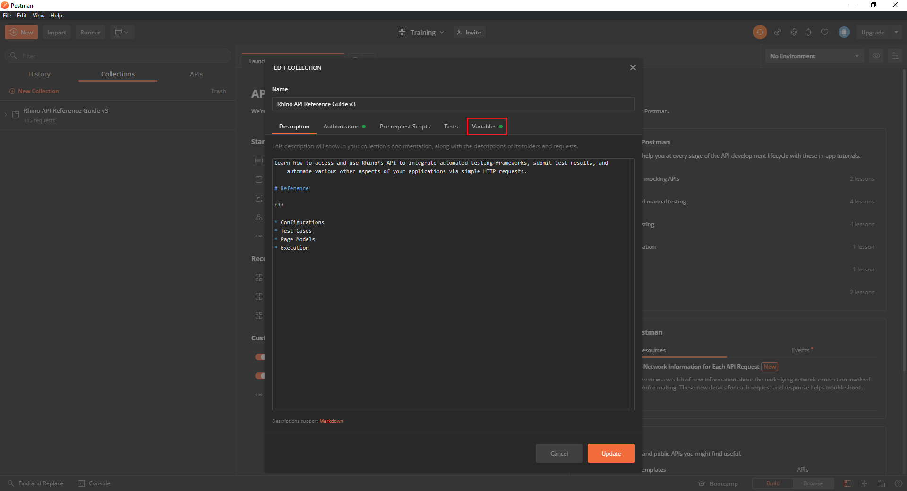
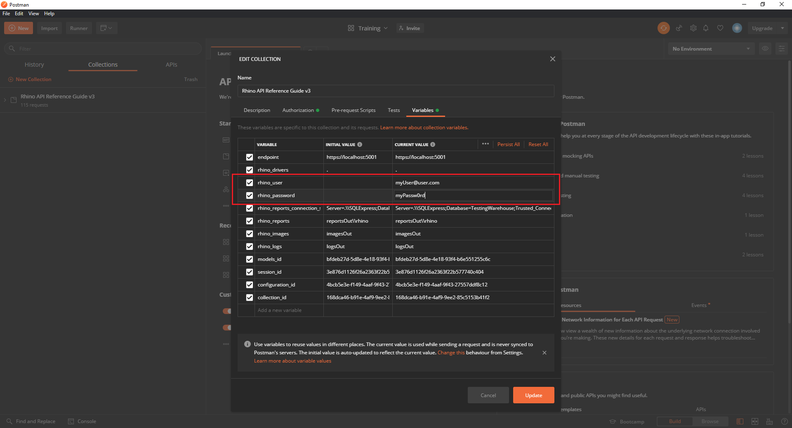
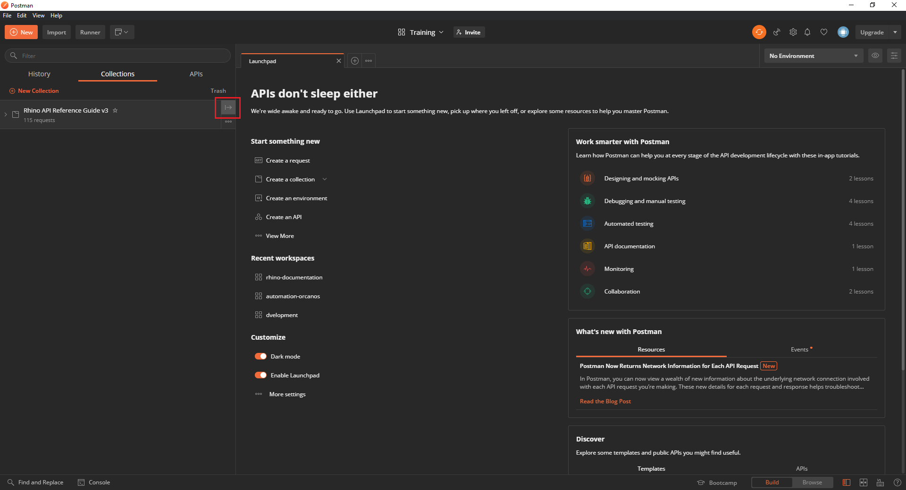
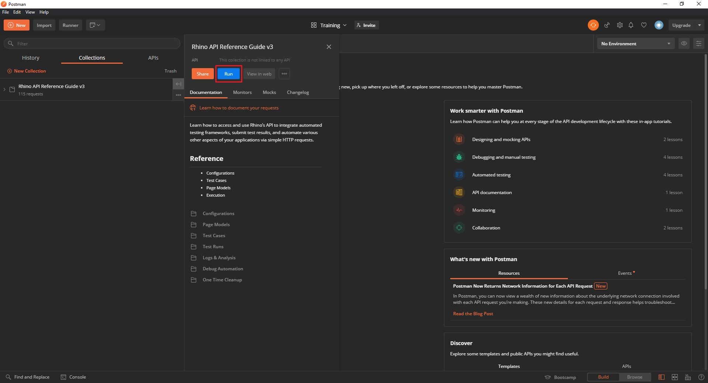
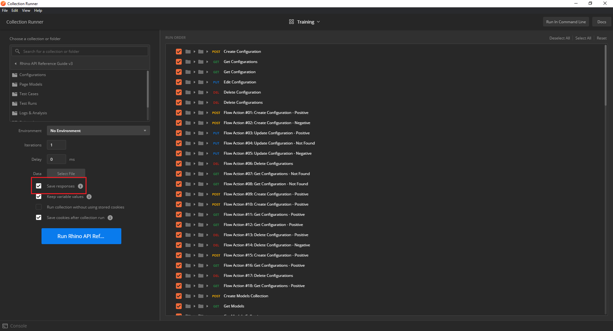

# Verify Rhino Deployment
Rhino API runs .NET Core 3.1.  

> This is an optional process and can be skipped if you already know that Rhino is correctly deployed

## Supported OS
Please read [here](https://github.com/dotnet/core/blob/master/release-notes/3.1/3.1-supported-os.md) for OS support matrix.

## Requierments
1. .NET Core 3.1 installed, read [here](https://dotnet.microsoft.com/download/dotnet/current) for more information about how to download and install.
2. [Development or other SSL certificate installed. This is optional and only required if you are working against HTTPS sites or if you want secured connections.](./Deployment.md)
3. Postman installed (latest version), read [here](https://www.postman.com/downloads/) for more information about how to download and install.

## Import Rhino API Documentation and Validation Tests
Rhino API use Postman for documentation and verification tests. Each  version comes with own documentation and tests and it is a very valuable resource.  

1. Open Postman application
2. Click on ```Import``` button  

  

3. Under ```IMPORT``` dialog, click on ```Upload File``` button  

 

4. Select the folder under which you [deployed Rhino](./Deployment.md)
5. Find the folder ```api-documentation``` and open it
6. Find the file ```Rhino API Reference Guide v3.postman_collection.json``` and double click on it or select it and click on ```Open``` button  

  
  

7. Click on ```import``` button  

  
  

8. Hover with the mouse cursor over the collection you have just created and click on the ```More Actions``` button.  

  

9. click on ```Edit``` option  

  

10. click on ```Variables``` tab  

  

11. Set the user and password [you have registered with](./Register) under the user and password parameters  

  

12. Hover with the mouse cursor over the collection you have just created and click on the ```Expand``` arrow.  

  

13. Click on ```Run``` button - the ```Collection Runner``` window will open.  

  

14. Check the ```Save Responses``` check box  

  

15. Click on ```Run ...``` button  

  

At this point, a set of tests will run against Rhino API. If some tests will fail, checking the response under the failed test will explain why and
suggest how to fix the problem (if any).  

> Please note, some of the tests requires a connection to the outside world. If you are running in an isolated environment without connection, these tests will fail
> but if all other tests have passed, you can ignore these failed tests.